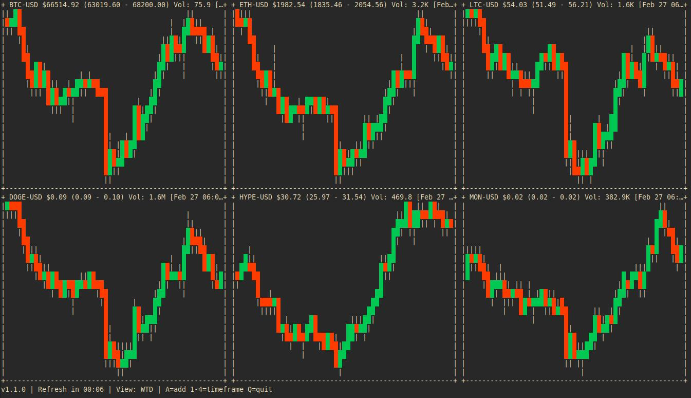

# Terminal Crypto Candle Graph Watcher

A high-performance, **fully responsive** Go terminal UI application that displays live ASCII candlestick charts for cryptocurrency pairs. Built with **Charm Bracelet's Bubble Tea**, ensuring snappy key responsiveness and smooth event handling. Pulls OHLCV data from multiple free sources and renders real-time, interactive charts in a auto-tiling grid layout.

## Features

Works on Windows, Linux and MacOSX!

- 🕯️ **ASCII Candlestick Charts** – Beautiful colored candles rendered directly in the terminal
- ⚡ **Fully Responsive** – Powered by Bubble Tea for instant key responsiveness, no freezing or lag
- 🔄 **Multi-Source Data** – Automatic fallback between CoinGecko and Coinbase APIs
- 🎨 **Auto-Tiling Layout** – Charts intelligently rearrange as you add/remove symbols
- ➕ **Dynamic Symbol Management** – Press `A` to add/remove crypto pairs via interactive modal (and press `c` inside modal to type any custom symbol)
- 💾 **Persistent Configuration** – Current symbol list and settings saved to `~/.crypto-graph-tui.json`
- ⏱️ **Configurable Timeframes** – Toggle between 1D, Weekly, Monthly, and Yearly views
- 🛡️ **Signal-Safe** – Respects Ctrl+C (quit)
- 📊 **Real-Time Refresh** – Continuous updates with countdown timer

## Requirements

- Go 1.24+
- Terminal with 256-color support

## Installation

Download binary for your operation system from [latest releases](https://github.com/rnts08/crypto-graph-tui/releases) or build from source.

```bash
cd /path/to/graph_watcher
make build
```

The binary will be created as `./crypto-graph-tui-<OS>-<ARCH>`. For example, building on Linux x86_64 produces `./crypto-graph-tui-linux-amd64` (Windows builds produce a `.exe` suffix).

## Usage

### Basic usage (default symbols: BTC-USD, ETH-USD, LTC-USD, SOL-USD)

```bash
./crypto-graph-tui-<OS>-<ARCH>

# Example (Linux):
./crypto-graph-tui-linux-amd64

# Example (Windows PowerShell):
.\crypto-graph-tui-windows-amd64.exe
```



### Command-line options

The application now supports traditional CLI flags in addition to the single-argument
symbol list. Available options:

```bash
./crypto-graph-tui-<OS>-<ARCH> \ 
  --symbols="BTC-USD,ETH-USD,ADA-USD" \ 
  --api-key="<CMC-key>" \ 
  --interval=30 \ 
  --theme=dark

# Example (Windows PowerShell):
.\crypto-graph-tui-windows-amd64.exe --symbols="BTC-USD,ETH-USD"
```

You can specify one of the built-in themes (`default`, `dark`, `retro`).

- `--symbols`: comma-separated list of symbols; overrides config.
- `--api-key`: optional API key for providers like CoinMarketCap.
- `--interval`: refresh interval in seconds (overrides config).

You can still supply a bare symbol string as the first argument for quick runs:

```bash
./crypto-graph-tui-<OS>-<ARCH> "BTC,ETH"

# Example (Linux):
./crypto-graph-tui-linux-amd64 "BTC,ETH"
```

Symbol names can be uppercase or lowercase; `-USD` suffix is optional.

## Controls

| Key | Action |
|-----|--------|
| **A** | Open symbol selection modal |
| **1** | Switch to 1D (daily) view |
| **2** | Switch to WTD (week-to-date) view |
| **3** | Switch to MTD (month-to-date) view |
| **4** | Switch to YTD (year-to-date) view |
| **Q** | Show quit confirmation |
| **Space** (in modal) | Toggle symbol selection |
| **C** (in modal) | Enter custom symbol by typing (e.g. `BTC`) |
| **Enter** (in modal) | Apply changes |
| **Esc** (in modal) | Cancel and close modal |
| **↑/↓ or K/J** (in modal) | Navigate symbol list |
| **Ctrl+C** | Quit immediately |

## Configuration

Configuration is stored at:

- `$XDG_CONFIG_HOME/crypto-graph-tui/config.json` (preferred), or
- `~/.crypto-graph-tui.json` (fallback)

Example config:

```json
{
  "symbols": ["BTC-USD", "ETH-USD", "SOL-USD"],
  "view": "1D",
  "refresh_interval_secs": 60,
  "api_key": ""
}
```

The app automatically saves your symbol selections and preferred timeframe.

## Data Sources

### Debug logging

Set the environment variable `CMC_DEBUG=1` to enable verbose HTTP
logging from the CoinGecko/Coinbase providers. Useful for troubleshooting
network errors or examining request URLs.


Charts are powered by:

1. **CoinGecko** – Free OHLC endpoint (primary)
2. **Coinbase** – Public exchange API (fallback)

Both sources are free and do not require authentication. If one fails, the app automatically tries the other.

## Common Symbols

The built-in symbol list includes major cryptocurrencies, for example:

- BTC (Bitcoin)
- ETH (Ethereum)
- SOL (Solana)
- LTC (Litecoin)
- ADA (Cardano)
- MATIC (Polygon)
- AVAX (Avalanche)
- DOGE (Dogecoin)
- XRP (Ripple)
- XMR (Monero)

## Layout Behavior

- **1 symbol**: Full-width chart
- **2+ symbols**: Multi-column grid with automatic sizing
- Charts auto-fit their space and re-render on window resize

## Development

```bash
git checkout -b new_branch
```

Do your changes, and fixes

```bash
git commit -a
git push
```

Make a pull requests

### Running Tests

```bash
make test
```

All modules include unit tests:

- `config_test.go` – Configuration loading, saving, and merging
- `chart_test.go` – ASCII rendering and layout math
- `provider_test.go` – Data provider logic and fallback mechanism

### Building

```bash
make build
```

### Cleaning

```bash
make clean
```

## Architecture

- **main.go** – Entry point, signal handling, config integration
- **ui.go** – Bubble Tea Model implementation, event handling, rendering
- **config.go** – Persistence and loading of user settings
- **provider.go** – CoinGecko and Coinbase API clients with fallback
- **chart.go** – ASCII rendering and layout utilities
- **types.go** – Core data structures (Candle)

## Error Handling

- API failures display an error message in the affected chart tile
- Network timeouts (10s per request) are respected
- The app never crashes or hangs—it closes gracefully on signal or error
- All background loops are reactive and non-blocking

## Future Enhancements

- Additional data sources (Binance, Kraken, etc.)
- Volume visualization in charts
- Per-symbol refresh intervals
- Color themes and alternate renderers

## Contributing

Pull requests welcome! Please include tests for any new functionality.

## Support and donations

Support the Project

ETH/ERC20: ***0x9b4FfDADD87022C8B7266e28ad851496115ffB48***

SOL: ***68L4XzSbRUaNE4UnxEd8DweSWEoiMQi6uygzERZLbXDw***

BTC: ***bc1qkmzc6d49fl0edyeynezwlrfqv486nmk6p5pmta***
